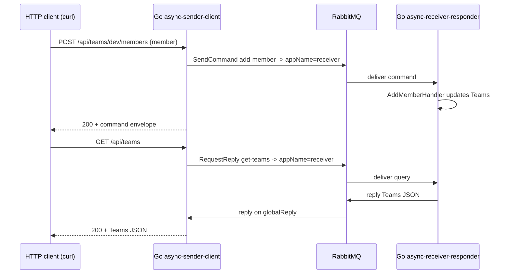

# async-sender-client

Go port of [reactive-commons-java/samples/async/async-sender-client](https://github.com/reactive-commons/reactive-commons-java/tree/master/samples/async/async-sender-client).

A small REST service registered as `appName=sender` that translates HTTP
requests into reactive-commons calls — domain events, notifications, commands,
and async queries — all targeting `appName=receiver`. Pair it with the
[`async-receiver-responder`](../async-receiver-responder) example (or the Java
receiver) to see the full round-trip.

## Prerequisites

- A running RabbitMQ at `localhost:5672` (guest/guest).
- The receiver-responder running in another terminal so the queries and
  commands actually have a counterpart:

  ```bash
  go run ./examples/async-receiver-responder
  ```

## Run

```bash
go run ./examples/async-sender-client
```

The HTTP server binds `:4001` (matching the Java sample's `server.port`). The
example is split across `main.go`, `handlers.go`, and `model.go`, so use
`go run ./examples/async-sender-client` (or `go run .` from inside the
directory) — `go run main.go` will not work.

## Endpoints

| Method | Path                                         | reactive-commons call                              | Routing key / Resource     |
| ------ | -------------------------------------------- | -------------------------------------------------- | -------------------------- |
| DELETE | `/api/teams`                                 | `EventBus().EmitNotification(...)`                 | `data-reset`               |
| GET    | `/api/teams`                                 | `Gateway().RequestReply(..., "receiver")`          | `get-teams`                |
| GET    | `/api/teams/{team}`                          | `Gateway().RequestReply(..., "receiver")`          | `get-team-members`         |
| POST   | `/api/teams/{team}/members`                  | `Gateway().SendCommand(..., "receiver")`           | `add-member`               |
| DELETE | `/api/teams/{team}/members/{member}`         | `EventBus().Emit(...)`                             | `member-removed`           |
| GET    | `/api/animals/{event}`                       | `EventBus().Emit(...)`                             | `animals.{event}`          |

Each handler caps the broker call at a 10 s timeout; on failure it returns
`500` (or `504` when the broker reply timed out) with a JSON error envelope
`{"error":"...","op":"..."}`.

## Sample requests

```bash
# Add a member to the "dev" team
curl -X POST http://localhost:4001/api/teams/dev/members \
     -H 'Content-Type: application/json' \
     -d '{"username":"jdoe","name":"Jane Doe"}'

# List all teams
curl http://localhost:4001/api/teams

# List members of the "dev" team
curl http://localhost:4001/api/teams/dev

# Remove a member (emits a `member-removed` event)
curl -X DELETE http://localhost:4001/api/teams/dev/members/jdoe

# Reset all teams (emits a `data-reset` notification)
curl -X DELETE http://localhost:4001/api/teams

# Trigger an animal event matching `animals.#`
curl http://localhost:4001/api/animals/dogs
curl http://localhost:4001/api/animals/cats.angry
```

## Flow



## Configuration parity with the Java sample

The Java `application.yaml` sets `spring.application.name=sender` and
`server.port=4001`; we mirror both via `cfg.AppName = "sender"` and the
hard-coded `:4001` listener address.

We also enable `WithDLQRetry: true` and `QueueType: "quorum"` to match the
[`async-receiver-responder`](../async-receiver-responder) example. Those
arguments are immutable once a queue exists, so the sender's reply queue
(`sender.{uuid}`) and the receiver's queues need to agree — otherwise
RabbitMQ rejects redeclaration with `PRECONDITION_FAILED (406)`.

## Differences from the Java sample

- **`DELETE /api/teams` calls `EmitNotification`, not `Emit`.** The Java
  controller uses `domainEventBus.emit(event)` for `data-reset`, but both the
  Java [`HandlersConfig`](https://github.com/reactive-commons/reactive-commons-java/blob/master/samples/async/async-receiver-responder/src/main/java/sample/HandlersConfig.java)
  and the Go [`async-receiver-responder`](../async-receiver-responder)
  subscribe via `listenNotificationEvent` / `ListenNotification`. We publish
  on the notifications exchange so the receivers actually pick it up.
- **`/api/animals/{event}` prepends `animals.`** to the path variable. The Java
  controller forwards the path verbatim (the Java tests then call
  `/api/animals/animals.dogs`); we make the URL friendlier
  (`/api/animals/dogs`) while still emitting `animals.dogs` on the wire so the
  receiver's `animals.#` binding matches.
- **No actuator / Prometheus.** The Java config exposes `/actuator/health` and
  `/actuator/prometheus`; this Go example sticks to the six business
  endpoints. Add your own `net/http` middleware if you need observability.
- **No external HTTP router.** The example uses stdlib `net/http` with Go
  1.22+ method+path patterns to avoid pulling in extra dependencies.
